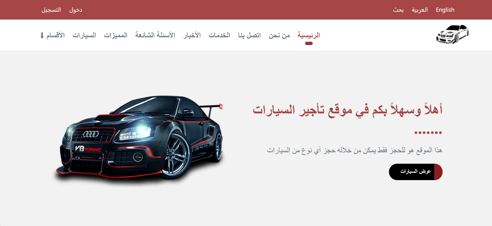

# 🚗 Car Rental Website

A modern and responsive car rental website built using HTML, CSS, and JavaScript.
The project showcases a complete UI for browsing cars, viewing details, and exploring categories.

---

## ✨ Features

* 🚘 Browse available cars with detailed information
* 📊 Statistics section (cars, customers, bookings, etc.)
* 💬 Customer testimonials
* 🏷️ Car categories and brands
* 📱 Fully responsive design (mobile & desktop)
* 🎨 Clean and modern user interface

---

## 🛠️ Technologies Used

* HTML5
* CSS3
* Font Awesome (icons)

---

## 📸 Screenshots



---

## 🚀 Live Demo

https://mahmoudkourd2004-prog.github.io/car-rental-website/ 


---

## 📁 Project Structure

```
car-rental-website/
│── index.html
│── css/
│   └── style.css
│── js/
│   └── main.js
│── images/
```

---

## 📌 Notes

This project was designed and developed as part of my front-end learning journey.
All UI and structure were built and customized by me.

---

## 👨‍💻 Author

**Mahmoud S Elkourd**

---

## 📄 License

This project is for educational purposes only.
